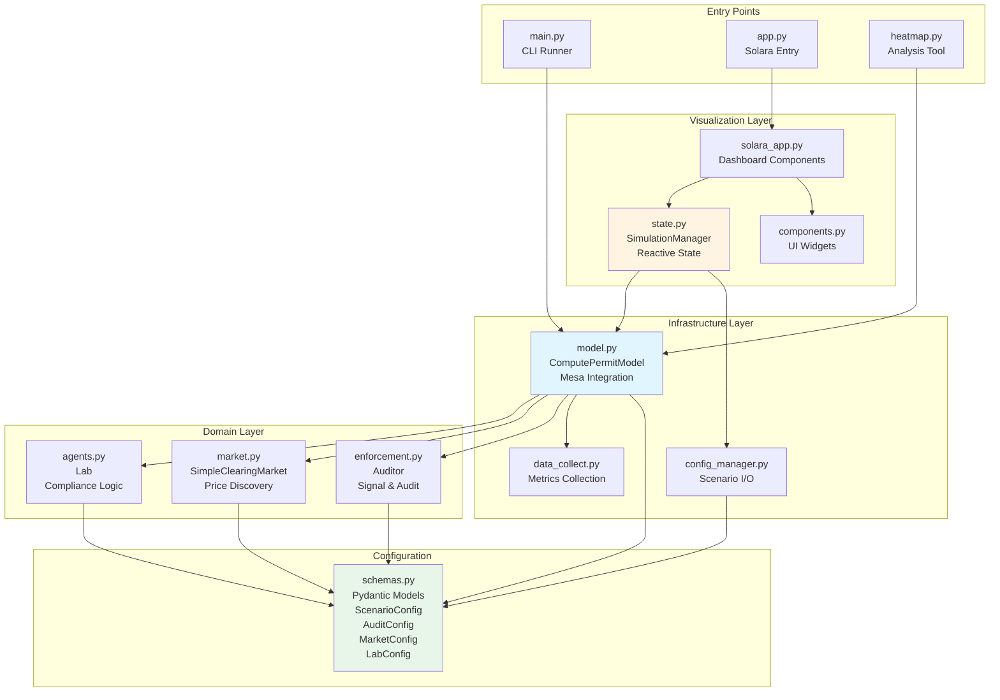
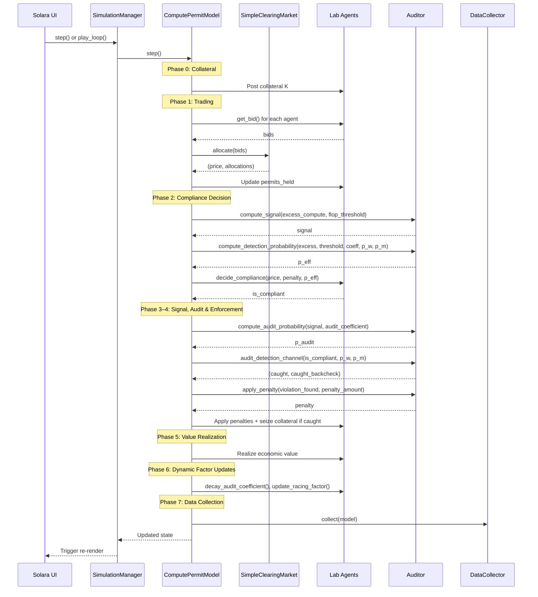

# Technical Documentation: Compute Permit Simulator

This document describes the functional relationships between components. For usage and installation, see [README.md](README.md).

## System Architecture

(Paste into an editor with Mermaid support if needed)


## Component Relationships

**Domain Layer** (`core/`): Model logic.
- `agents.py`: `Lab` class implements compliance decision (`decide_compliance()`) using deterrence condition `p_eff * B_total >= gain`
- `market.py`: `SimpleClearingMarket` handles price discovery (Qth highest bid) and permit allocation
- `enforcement.py`: `Auditor` implements two-stage audit model (signal → audit → outcome)

**Infrastructure Layer** (`services/`): Mesa integration and simulation control.
- `mesa_model.py`: `ComputePermitModel` orchestrates the simulation loop (see below)
- `config_manager.py`: Loads/saves JSON scenarios as validated `ScenarioConfig` objects
- `metrics.py`: Compliance and run-metrics calculations from agent snapshots

**Visualization Layer** (`vis/`): Interactive UI and state management.
- `simulation.py`: `SimulationEngine` manages reactive state, bridges UI ↔ Model
- `page.py`: Solara entry point (ConfigPanel, Dashboard, InspectorTab)
- `components/`: Reusable UI widgets (scatter plots, range controls, cards)

**Configuration** (`schemas/`): Pydantic models (`AuditConfig`, `MarketConfig`, `LabConfig`, `ScenarioConfig`) used throughout for type-safe configuration.

## Regulatory Framework

### FLOP Threshold
Training runs require permits when `planned_training_flops > flop_threshold` (set in `ScenarioConfig`). Signal strength for enforcement scales with FLOP excess above this threshold. Default: 10²⁵ FLOP (EU AI Act "high-impact" level).

FLOP scaling reference:
| Scale | FLOPs | Approximate Cost |
|-------|-------|-----------------|
| GPT-3 | 10²³ | ~$5M |
| GPT-4 | 10²⁴ | ~$50M |
| Near-future frontier | 10²⁵ | ~$500M |
| Projected 2027 | 10²⁶ | ~$5B |

### Penalty Structure
Penalties are defined simply via a flat per-firm amount (`penalty_amount`) set at instantiation.
Ref: Christoph (2026) §2.5 — P_eff = min(K + φ, L)

### Collateral / Staking Mechanism
Optional refundable deposit (`collateral_amount` on `ScenarioConfig`, default 0 = disabled). Per-step lifecycle:

1. Labs post collateral K (deducted from wealth)
2. Collateral locked for the step
3. If caught violating: collateral seized (adds to effective punishment)
4. If not caught: collateral refunded at end of step

Labs factor collateral into compliance decision:
```
B_total = (penalty + collateral_posted + reputation_sensitivity) × risk_profile
```

Ref: Christoph (2026) §2.5, Proposition 3 — collateral K relaxes limited liability constraints.

### Two-Stage Audit Model
The `Auditor` implements a realistic enforcement process:

| Stage | Method | Determines | Parameters |
|-------|--------|------------|------------|
| **1a. Signal** | `compute_signal()` | Suspicion signal from excess FLOP | `excess_compute`, `flop_threshold`, `signal_exponent` |
| **1b. Audit Occurrence** | `compute_audit_probability()` | Whether audit is initiated | `base_prob` (π₀), `audit_coefficient` c(i), `signal_dependent` |
| **2. Audit Outcome** | `audit_detection_channel()` | Whether violation is detected | `false_negative_rate` (β), `backcheck_prob`, `whistleblower_prob`, `monitoring_prob`, `false_positive_rate` (α) |

**Signal Strength Formula** (for non-compliant firms):
```
signal = min(1.0, (used_compute / flop_threshold)^signal_exponent)
```
- At `signal_exponent=1.0` (linear), 50% excess → 0.5 signal. 
- Higher exponents create a more convex, lenient regime for minor infractions.

**Effective Detection Probability**:
```
# if signal_dependent=True:
p_audit = min(1.0, base_prob + c(i) × signal × (1.0 - base_prob))
# if signal_dependent=False:
p_audit = base_prob

miss    = false_negative_rate × (1 - backcheck_prob) × (1 - p_w) × (1 - p_m)
p_catch = 1 - miss
p_eff   = p_audit × p_catch
```
`base_prob` is a uniform floor applied equally to all firms (random audits). `c(i)` only scales the signal-dependent component, so firm-specific audit rate differences arise from violation visibility, not the random baseline. When `signal_dependent=False`, `c(i)` has no effect. `p_w` (whistleblower) and `p_m` (monitoring) are nested within `p_catch`: they provide additional detection when the direct audit pass and backcheck both miss.

## Simulation Loop

The `ComputePermitModel.step()` method executes seven phases per step. This follows the timing model from Christoph (2026) §2.6: announce → post collateral → allocate permits → trade → choose usage → signals → audit → penalty/refund.

(Paste into an editor with Mermaid support if needed)


**Phase 0 - Collateral**: Labs post refundable deposit K. Skipped when `collateral_amount = 0`.

**Phase 1 - Trading**: Above-threshold labs submit bids → `Market.allocate()` → uniform-price auction → `permits_held` updated (supports multi-unit FLOP-denominated permits when `flops_per_permit` is set)

**Phase 2 - Compliance Decision**: Per-agent detection probability calculated via `compute_detection_probability()` using expected signal from `planned_training_flops` vs `flop_threshold` → labs with unpermitted excess call `decide_compliance()` → deterrence condition: `p_eff × B_total >= gain` where `B_total = (penalty + collateral + reputation_sensitivity) × risk_profile`

**Phase 3–4 - Signal, Audit & Enforcement**: Actual training FLOP excess generates signal → `compute_audit_probability()` applies `base_prob` as a uniform floor; when `signal_dependent=True`, `audit_coefficient` scales the signal boost above that floor → `audit_detection_channel()` uses FNR/backcheck for two-stage outcome, with whistleblower (`p_w`) and monitoring (`p_m`) as nested fallback channels within the audit event → flat `penalty_amount` applied if caught → collateral seized on violation → `on_audit_failure()` escalates reputation sensitivity and audit coefficient

**Phase 5 - Value Realization**: Labs that ran realize `economic_value`

**Phase 6 - Dynamic Factor Updates**: Audit coefficients decay toward base via `decay_audit_coefficient()` → racing factors updated via `update_racing_factor()` based on relative capability position

**Phase 7 - Data Collection**: `DataCollector.collect()` → update reactive state

## Dynamic Factors

All dynamic factors default to 0.0 (static behavior). Set > 0 to activate.

### Reputation Sensitivity Escalation
Each failed audit multiplies reputation sensitivity:
```
reputation_sensitivity_t = base × (1 + escalation_factor)^failed_audit_count
```
- `reputation_escalation_factor = 0.0` (static) or e.g. `0.5` (+50% per failure)
- Stored as `current_reputation_sensitivity` on Lab, used in `decide_compliance()`

### Audit Coefficient Escalation & Decay
Failed audits increase a lab's audit coefficient (making future audits more likely). The excess decays exponentially toward the base each step:
```
on failure: audit_coefficient += audit_escalation
each step:  excess = current - base; current = base + excess × (1 - decay_rate)
```
- `audit_escalation = 0.0` (static) or e.g. `1.0` per failure
- `audit_decay_rate = 0.2` (20% decay per step toward base of 1.0)

### Racing Factor Dynamics
Racing pressure adjusts based on relative capability position:
```
racing_t = base_racing × (1 + gap_sensitivity × gap / capability_scale)
```
where `gap = cumulative_capability - mean_capability`.
- `racing_gap_sensitivity = 0.0` (static) or e.g. `0.5` (moderate dynamics)
- `capability_scale = 100.0` (normalization factor)

## Unit Conventions

All monetary values are in **millions of USD (M$)**. This includes:
- `economic_value`: Training run value (M$)
- `penalty_amount`: Flat per-firm penalty (M$)
- `collateral_amount`: Refundable deposit (M$)
- `reputation_sensitivity`: Perceived brand/trust damage (M$)

Training run compute is measured in **FLOPs** (floating point operations).
- `flop_threshold`: Regulatory threshold (FLOP)
- `planned_training_flops`: Per-lab training run size (FLOP)
