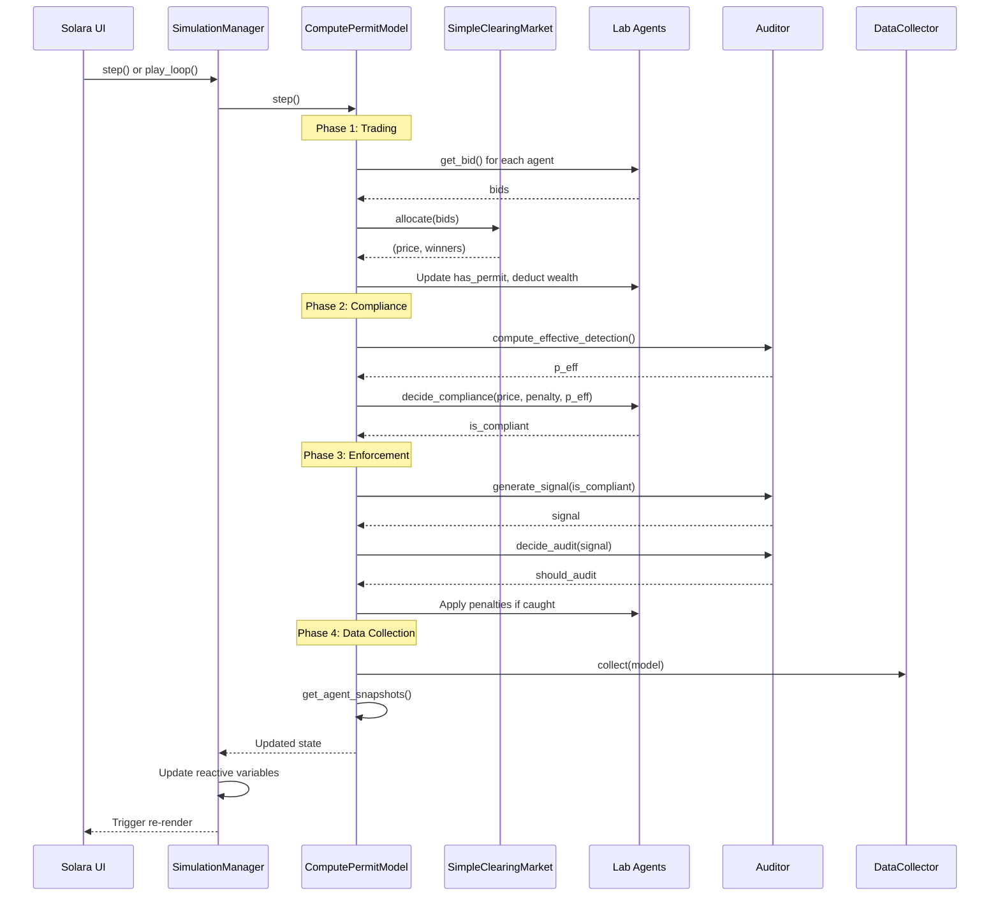

# Technical Documentation: Compute Permit Simulator

This document describes the functional relationships between components. For usage and installation, see [README.md](README.md).

## System Architecture

(Paste into an editor with Mermaid support if needed)

## Component Relationships

**Domain Layer** (`domain/`): Model logic.
- `agents.py`: `Lab` class implements compliance decision (`decide_compliance()`) using deterrence condition `p_eff * B_total >= gain`
- `market.py`: `SimpleClearingMarket` handles price discovery (Qth highest bid) and permit allocation
- `enforcement.py`: `Auditor` generates noisy signals and decides audits

**Infrastructure Layer** (`infrastructure/`): Mesa integration and simulation control.
- `model.py`: `ComputePermitModel` the 4-phase simulation loop (see below)
- `config_manager.py`: Loads/saves JSON scenarios as validated `ScenarioConfig` objects
- `data_collect.py`: Reporter functions for Mesa DataCollector (compliance rate, price)

**Visualization Layer** (`vis/`): Interactive UI and state management.
- `state.py`: `SimulationManager` manages reactive state, bridges UI ↔ Model
- `solara_app.py`: Solara components (ConfigPanel, Dashboard, InspectorTab)
- `components.py`: Reusable UI widgets (scatter plots, range controls)

**Configuration** (`schemas.py`): Pydantic models (`AuditConfig`, `MarketConfig`, `LabConfig`, `ScenarioConfig`) used throughout for type-safe configuration.

## Simulation Loop

The `ComputePermitModel.step()` method executes four phases:

(Paste into an editor with Mermaid support if needed)

**Phase 1 - Trading**: Agents submit bids → `Market.allocate()` → price discovery → permit allocation → wealth deduction

**Phase 2 - Compliance**: Calculate `p_eff` → agents without permits call `decide_compliance()` → agents with permits auto-comply

**Phase 3 - Enforcement**: `Auditor.generate_signal()` → `decide_audit()` → apply capacity constraints → execute audits → apply penalties

**Phase 4 - Data Collection**: `DataCollector.collect()` → `get_agent_snapshots()` → update reactive state
